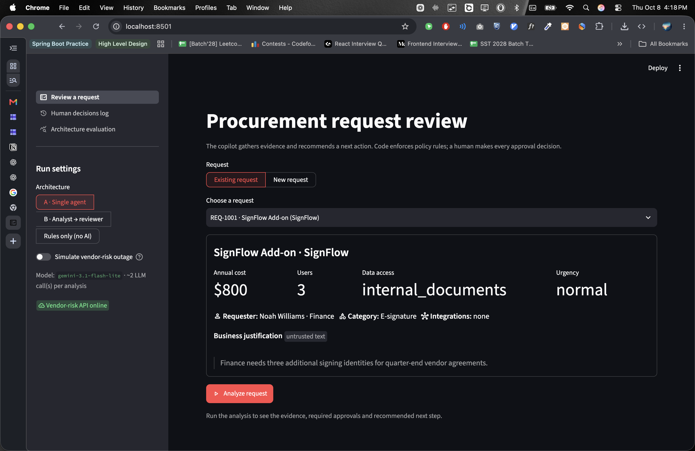
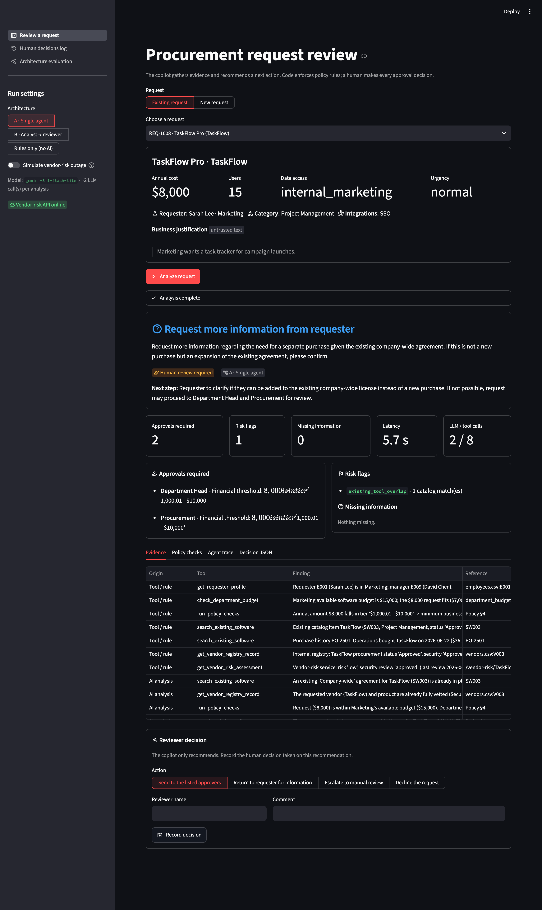
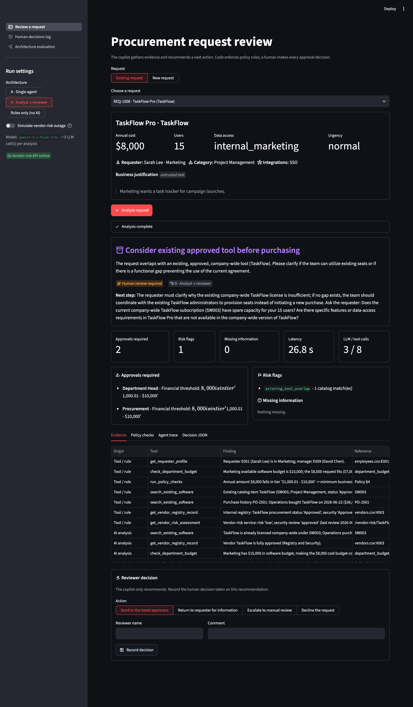
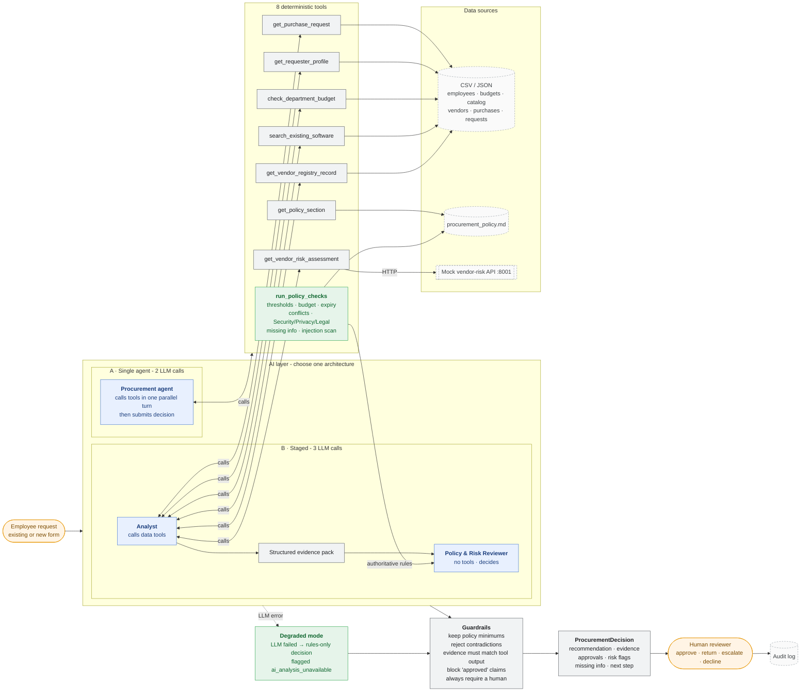

# AI Procurement Request Copilot

An internal tool that reviews software/service purchase requests. It gathers evidence with tools, applies the procurement policy deterministically, and recommends the next action. **A human makes every approval decision.**

> All companies, vendors, employees, prices and policies here are synthetic (FDE Assessment 3).

**Output for every request** (`ProcurementDecision`): recommendation · evidence · approvals required · missing information · risk flags · next step · `human_review_required` · telemetry.

---

## Quick start

Requires Python 3.11+ and a Google Gemini API key ([free key](https://aistudio.google.com/apikey)).

```bash
python -m venv .venv && source .venv/bin/activate     # fish: activate.fish · Windows: .\.venv\Scripts\Activate.ps1
python -m pip install -r requirements.txt
cp .env.example .env                                   # then set GOOGLE_API_KEY
python run_local.py                                    # one command: vendor-risk API :8001 + UI :8501
```

Open http://127.0.0.1:8501, pick a request (or submit a new one), choose an architecture and click **Analyze request**.

| Command | What it does |
|---|---|
| `python verify_setup.py` | Pre-flight: packages, data integrity, contract, mock API |
| `python -m unittest discover -s tests` | 32 offline tests: policy engine, guardrails, injection scanner, UI smoke test (no API key needed) |
| `python evals/run_public_evals.py --architecture single` (or `staged`) | Starter-pack public harness (6 cases) |
| `python evals/run_eval.py` | Full comparison: 16 cases × single / staged / rules-only, writes `evals/results/` |

The app works **without** an API key: it runs in degraded mode (deterministic decision, flagged `ai_analysis_unavailable`). Both eval scripts start the mock vendor-risk API automatically if it isn't running.

---

## Product workflow

1. **Request.** Pick an existing request or submit a new one (form). Free text is shown and treated as *untrusted*.
2. **Understand + gather evidence.** The agent calls tools for the requester, budget, catalog/purchase history, vendor registry, the vendor-risk API, and the policy engine.
3. **Deterministic checks.** Thresholds, budget, vendor review expiry and conflicts, Security/Privacy/Legal triggers, missing fields and the injection scan all run in code.
4. **Recommend.** The LLM picks the next action (`proceed_to_approval_routing`, `route_for_specialist_review`, `request_more_information`, `reuse_existing_tool`, `manual_review_required`), explains it, and proposes a next step and questions for the requester.
5. **Guardrails.** Code merges in the policy minimums, rejects contradictions, keeps only grounded evidence, and forces human review.
6. **Human review.** The reviewer sees the recommendation, approvals (each with its reason), flags, missing info, evidence table, policy checks and the full agent trace. They then record a decision (send for approvals / return to requester / escalate / decline). Decisions go to an audit log (**Human decisions log** page).

The UI also has an **Architecture evaluation** page and a sidebar toggle that **simulates a vendor-risk outage**, to demonstrate graceful degradation live.

## Screenshots

**1. Request intake.** Pick an existing request or submit a new one. The business justification is labelled as untrusted text. The sidebar selects the architecture, a rules-only mode, and a simulated vendor-risk outage.



**2. Architecture A (single agent) on REQ-1008.** 2 LLM calls, 5.7 s. The page shows:
- the recommendation and next step, with "Human review required" always on
- approvals with their reasons, and risk flags
- evidence split into deterministic tool/rule rows and grounded AI-analysis rows
- the reviewer decision panel



**3. Architecture B (analyst → reviewer) on the same request.** 3 LLM calls, 26.8 s. Same layout; the Agent trace tab also shows the analyst's evidence pack.



## Architecture

More detail (guardrail rules, escalation table, what was intentionally not built) is in **[docs/architecture.md](docs/architecture.md)**.

### Architecture diagram

Blue = AI · gray = code · green = rule engine / fallback · dashed = data · orange = human.



| | A - Single agent | B - Staged / 2-agent |
|---|---|---|
| LLM roles | One tool-calling agent | Procurement Analyst (tool-calling) → Policy & Risk Reviewer (no tools) |
| Handoff | - | Structured evidence pack (facts with source tool, existing-tool assessment, tool failures, untrusted-content notes, open questions) |
| Deterministic engine | Called by the agent as a tool (`run_policy_checks`) | Run by the orchestrator between the two agents |
| Guardrails, degraded mode, telemetry | Shared | Shared |

```
src/
  tools.py          8 deterministic tools + Gemini function declarations
  policy_engine.py  policy rules (parsed from procurement_policy.md) -> approvals, flags, missing info, checks, evidence
  safety.py         prompt-injection scanner for untrusted business data
  agents.py         Architecture A agent; Architecture B analyst + reviewer; prompts and schemas
  guardrails.py     code-enforced controls on every LLM output + evidence grounding check
  pipeline.py       orchestration for single / staged / rules, degraded mode, telemetry and trace
  llm.py            Gemini REST client: header auth, timeouts, retry honouring RetryInfo, quota fail-fast
  solution.py       handle_request(request_id, architecture) adapter for the harness
app.py, app_pages/  Streamlit UI (review, decisions log, evaluation)
evals/              public harness, extended case set, comparison runner, results
```

### Tools

All 8 tools are deterministic code. The LLM decides which to call and interprets the results.

| Tool | Data source | Returns |
|---|---|---|
| `get_purchase_request` | `requests.json` / UI form | The request, marked as untrusted text |
| `get_requester_profile` | `employees.csv` | Department, level, manager |
| `check_department_budget` | `department_budgets.csv` | Cost vs. available budget, remaining after purchase |
| `search_existing_software` | `software_catalog.csv`, `purchase_history.csv` | Same product / vendor / category matches, with reasons |
| `get_vendor_registry_record` | `vendors.csv` | Internal vendor status, review age vs. the reference date, legal terms |
| `get_vendor_risk_assessment` | Mock vendor-risk API (HTTP) | External security assessment; `unavailable` / `not_found` instead of crashing |
| `get_policy_section` | `procurement_policy.md` | Policy text by section or keyword |
| `run_policy_checks` | Policy engine | **Authoritative** approvals, flags, missing info and rule-by-rule checks |

### Agents

| Agent | Architecture | Job | Output |
|---|---|---|---|
| Procurement agent | A | Calls tools in one parallel turn, judges, recommends | `submit_decision` (structured JSON) |
| Procurement Analyst | B | Calls the data tools and summarises the facts | `submit_evidence_pack` (structured JSON) |
| Policy & Risk Reviewer | B | Reads the pack plus the engine results plus the policy, then recommends; has no tools | Structured decision (JSON schema) |

### Why this split

The brief's principle is *AI interprets, code enforces thresholds, humans approve*. Every rule the policy states precisely is decided in code: the §4 thresholds, the §2 budget check, the 365-day review window, the §5-§7 triggers and §1 completeness. The thresholds, reference date, review window and legal threshold are parsed from `data/procurement_policy.md`, so the policy file stays the source of truth.

The LLM handles what code can't decide well: whether an existing tool really covers the need (policy §3 says overlap is *not* automatic rejection), how the AI-tool rule (§8) applies, and what to ask the requester. Code then constrains the model's output, so a wrong model can make the recommendation less useful but can't make it less safe.

## Human controls and edge cases

| Edge case from the brief | What the system does |
|---|---|
| Incomplete / ambiguous request | Code checks every §1 field; the result is `request_more_information`, with the missing items listed. Unknown cost means no approval tier is guessed |
| Existing tool already solves the need | The catalog match is flagged (`existing_tool_overlap`); the LLM judges whether there's a real gap and can recommend `reuse_existing_tool` |
| Conflicting or expired vendor information | Registry and API are compared; a 365-day expiry check uses the policy's reference date (2026-09-30); `conflicting_vendor_evidence` / `vendor_review_expired` are flagged and Security is added; nothing is resolved silently |
| Security-sensitive request / approval threshold | Thresholds and Security / Privacy / Legal triggers are computed in code, each approval with its reason; the LLM can add an escalation but never remove one |
| Prompt injection inside business data | A regex scanner flags it (`prompt_injection_detected`) and shows the snippet; the text is labelled untrusted in prompts; approvals are code-enforced, so injected text can't change them |
| Tool / API unavailable | `vendor_risk_unavailable`, Security added, `manual_review_required`, no favourable assumption. If the **LLM** fails, the rules-only decision is returned, flagged `ai_analysis_unavailable` |

**Human authority:**
- `human_review_required` is always `true`.
- The copilot never approves, buys or changes budgets, and text claiming "has been approved" is blocked.
- A reviewer records the final action in the UI, and it goes to an audit log.

## Assumptions

- **Reference date** 2026-09-30, read from the policy. A security review is current for 365 days.
- **Thresholds use the annual amount**; one-time purchases count as their annual amount.
- **New vendor** means not in the registry, or registry status New/Pending. Unknown vendors need Security (no assessment) and Legal (terms unknown).
- **Status matching:** registry "Pending" vs. API `not_completed` is consistent; Approved vs. expired, or different review dates, is a conflict.
- **`production_telemetry` data** counts as production access. SSO alone is not a security trigger.
- **Empty integrations list** (`[]`) means "none"; only a missing field counts as missing information.
- **Catalog overlap is always flagged** (policy §3). Whether to reuse instead is the LLM's judgement.
- **Unknown cost** means the approval tier can't be determined, so Procurement is listed for triage and the request goes back for information.

## Evaluation

See **[evals/README.md](evals/README.md)** for method and **[evals/results/summary.md](evals/results/summary.md)** for the latest numbers.

- **Same case set for both architectures:** the 6 public cases, the 4 remaining dataset requests, and 6 synthetic edge cases: tier boundaries ($1,000 and $25,500), a clean request during an API outage, a reworded injection, an unknown requester, and an unregistered vendor handling employee PII. Together they cover every edge case in the brief.
- **Scored per run:**
  - correct next action
  - policy followed (exact approvals, required/forbidden flags, missing info)
  - escalation correct
  - LLM evidence grounded in tool output
  - latency, LLM calls, tool calls and tokens
  - how often the guardrails had to correct the model
- **Rules-only baseline** (no LLM) is included so the LLM's added value is measured, not assumed.

<!-- RESULTS:START -->
| Measured | A: single agent | B: analyst → reviewer | Rules only |
|---|---:|---:|---:|
| LLM calls per request | 2 | 3 | 0 |
| Tool calls per request (telemetry) | 8 | 8 | 7 |
| REQ-1008 latency, gemini-3.1-flash-lite (2 runs each) | 4.2 s, 5.7 s | 15.5 s, 26.8 s | < 0.1 s |
| REQ-1008 ideal action "reuse existing tool" (3 runs each) | 2/3 | 2/3 | 0/1 |
| What the misses were | "request more info" (safe) | "request more info" (safe) | "proceed" |
| 16-case run, rules only | - | - | 15/16 (misses EV-08 only) |
| Policy failures found manually (approvals / flags in reviewed runs) | 0 | 0 | 0 |
| Approvals / flags / missing info | Shared engine + guardrails, so identical by construction | | |

The free Gemini tier (20 requests/day per model) prevented a full 16-case LLM run on the author's key. The numbers above are measured spot checks ([`evals/results/spot_checks/`](evals/results/spot_checks)) plus the full rules-only run ([`evals/results/summary.md`](evals/results/summary.md)). Run `python evals/run_eval.py` with a paid key to reproduce the complete table.
<!-- RESULTS:END -->

## Ship decision

**Architecture A, the single agent.** Policy compliance comes from the shared engine and guardrails, so the second stage can only change judgement quality, and on the measured runs it tied on quality (2/3 each) while costing 50% more LLM calls and about 4× the latency. Full reasoning is in **[docs/decision_memo.md](docs/decision_memo.md)** (≤ 500 words).

## Testing it yourself on a free key

The Gemini free tier allows **about 20 requests per model per day**. One analysis costs **2 calls (single)** or **3 calls (staged)**.

| Test | LLM calls |
|---|---:|
| `python -m unittest discover -s tests` (engine, guardrails, injection, UI) | 0 |
| UI with **Rules only (no AI)** selected, any number of requests | 0 |
| UI: one request on single / staged | 2 / 3 |
| `python evals/run_eval.py --only EV-08 EV-14 --architectures single staged` | 10 |
| `python evals/run_public_evals.py --architecture single` (6 cases) | 12 |
| `python evals/run_eval.py --architectures rules` (all 16 cases) | 0 |

Useful edge cases to try in the UI:
- **REQ-1006**: injection plus missing information.
- **REQ-1007**: conflicting vendor data.
- **REQ-1008**: an existing tool covers the need.
- **REQ-1009**: API outage.
- The sidebar **Simulate vendor-risk outage** toggle, on any request.

When a model's quota runs out, the app keeps working in degraded mode. To continue with AI, set `MODEL_NAME` in `.env` to another model with its own quota (e.g. `gemini-2.5-flash-lite`, `gemini-2.5-flash`).

## Known limitations

- **Gemini free-tier quota is tiny.** It allows 20 requests per model per day, and one full comparison needs about 80 LLM calls (2 per single run, 3 per staged run). The client fails fast on daily-quota 429s, and the eval runner stops and saves (`--resume` continues later). A paid key (cents per full run) is the realistic setup.
- **Small evaluation set.** 16 cases and 1 repeat by default, so results are indicative, not statistically strong. Use `--repeats` for variance.
- **Regex injection scanner.** It catches common override, fake-approval, bypass and exfiltration phrasings, not every paraphrase. The LLM is instructed to report what it sees, and controls don't depend on detection: approvals are code-enforced either way.
- **Heuristic "business purpose too vague" check** (fewer than 4 meaningful words after removing injected sentences).
- **Catalog matching** is by name containment / vendor / category, not semantic similarity.
- **No authentication.** The audit log is a local file, and reviewer identity is free text.
- **Request data is read live from the data files.** There is no database or write-back, by design (the copilot never changes records).
