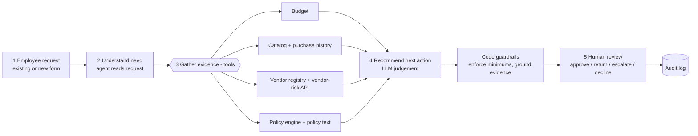
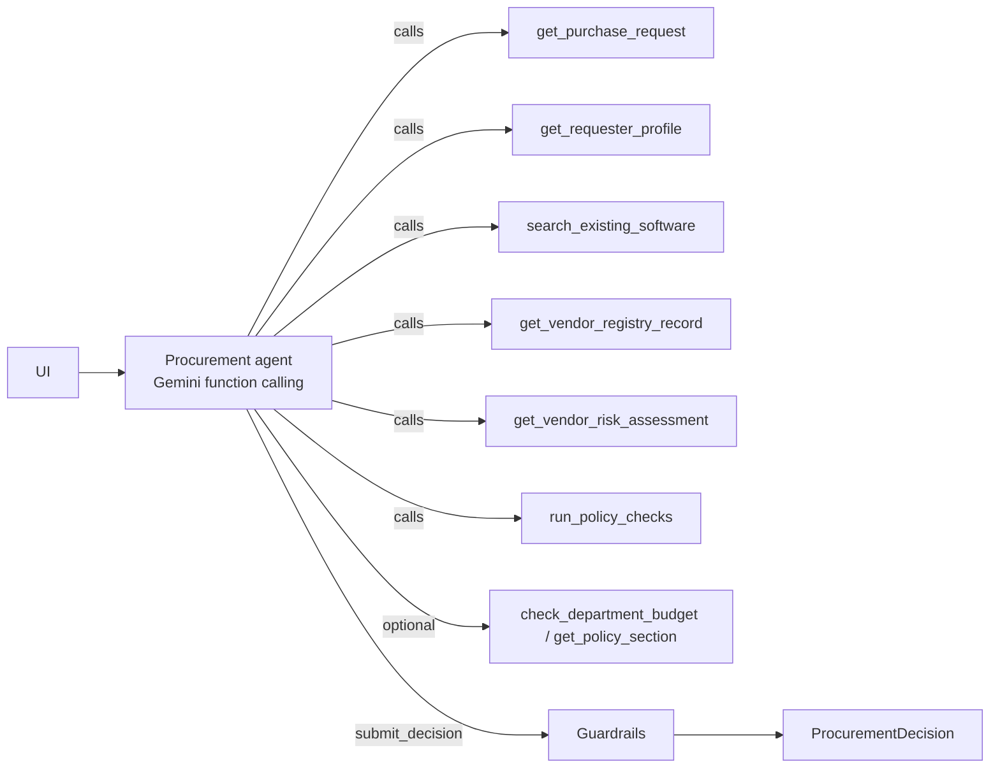
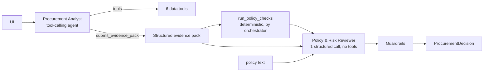

# Architecture and workflow

## Design principle

| Layer | Owns | Where |
|---|---|---|
| **AI** | Interpreting context: does an existing tool already meet the need, which next action fits, what to ask the requester, plain-language rationale | `src/agents.py` |
| **Code** | Everything the policy states as a rule: approval thresholds, budget, vendor review expiry (365 days from 2026-09-30), registry vs. service conflicts, Security / Privacy / Legal triggers, required fields, prompt-injection scan, grounding of evidence | `src/policy_engine.py`, `src/guardrails.py`, `src/safety.py` |
| **Human** | Every approval, exception and final decision. The copilot can only recommend; the reviewer's action is recorded in an audit log | `app_pages/review.py`, `src/review_log.py` |

## End-to-end workflow

## Architecture A - single agent (shipped)

A single tool-calling agent using exactly 2 LLM turns. The orchestrator pre-loads the request and requester profile (trivial lookups). The agent fans out to the evidence tools and `run_policy_checks` in one parallel turn, then submits a structured decision (the `submit_decision` function with a JSON schema). The guardrails run after it (see below). If the agent skips a tool, the guardrail layer fetches the missing evidence itself, so a lazy model cannot produce a decision on partial evidence.

## Architecture B - staged / 2-agent

The analyst uses 2 LLM turns: one parallel tool turn, then `submit_evidence_pack`. The reviewer is 1 call, for 3 LLM calls per request.

**Handoff format** (`submit_evidence_pack`): `request_summary`, `facts[] {source tool, finding, reference}`, `existing_tool_assessment`, `untrusted_content_observations[]`, `tool_failures[]`, `open_questions[]`. The reviewer receives the pack, the authoritative engine output and the policy text. It is told the pack is another model's summary and may be wrong.

## Tools

All tools are deterministic code. The LLM chooses which to call and interprets the results.

| Tool | Source | Purpose |
|---|---|---|
| `get_purchase_request` | `requests.json` (or a request submitted in the UI) | Request record, marked as untrusted text |
| `get_requester_profile` | `employees.csv` | Department, level, manager |
| `check_department_budget` | `department_budgets.csv` | Cost vs. **available** budget, remaining after purchase |
| `search_existing_software` | `software_catalog.csv`, `purchase_history.csv` | Same product / vendor / category matches, with reasons |
| `get_vendor_registry_record` | `vendors.csv` | Internal registry status, review age vs. the reference date, legal terms |
| `get_vendor_risk_assessment` | Mock vendor-risk API (HTTP) | External assessment; returns `unavailable` / `not_found` instead of raising |
| `get_policy_section` | `procurement_policy.md` | Policy text by section number or keyword |
| `run_policy_checks` | Policy engine | Authoritative approvals, flags, missing info and rule-by-rule checks |

## Guardrails (applied identically to A and B)

1. **Minimums can't be removed.** The engine's approvals, flags and missing info are always kept. The LLM may only add conservative escalations (Security / Privacy / Legal / injection).
2. **No contradicting deterministic facts.** The LLM can't add `budget_insufficient`, `vendor_review_expired`, etc., or threshold approvers (Finance/CFO/Department Head/Procurement) that the rules don't require. Rejected items are logged.
3. **Consistent recommendation.** Missing info forces `request_more_information`. `proceed_to_approval_routing` is blocked when specialist review is required. `reuse_existing_tool` requires a catalog overlap. Every override is recorded.
4. **Grounded evidence.** An LLM evidence item is kept only if its source tool was called in this run and every number and date it cites appears in a tool output. Duplicates of deterministic evidence are dropped.
5. **No approval claims.** Text such as "has been approved/purchased" is replaced. `human_review_required` is always `true`.
6. **Degraded mode.** If the LLM fails (quota, outage, timeout, invalid output), the run returns the rules-only decision flagged `ai_analysis_unavailable`. It never crashes and never infers a favourable status.

## Stop / escalation conditions

| Condition | Result |
|---|---|
| Required §1 field missing or unusable | `request_more_information`, `missing_information` populated |
| Vendor-risk API down, or registry and API disagree | `manual_review_required` (or specialist review), Security added, `vendor_risk_unavailable` / `conflicting_vendor_evidence` |
| Sensitive data / production / source code / expired or missing assessment | Security; PII adds Privacy; new vendor ≥ $10k, non-standard terms or cross-region PII adds Legal |
| Cost exceeds available budget | Finance budget exception, `budget_insufficient` |
| Embedded instructions in business data | Ignored, `prompt_injection_detected`, evidence shows the snippet |
| LLM unavailable | Deterministic decision, `ai_analysis_unavailable` |
| Every request | `human_review_required = true` |

## Assumptions

- **Reference date** 2026-09-30, read from the policy. A review is current for 365 days, so any review before 2025-09-30 is expired.
- **Annual cost** is the amount used for thresholds. One-time purchases are treated as their annual amount.
- **"New vendor"** means not in the registry, or registry procurement status New/Pending. Unknown vendors get Security (no assessment) and Legal (terms unknown).
- **Registry Pending vs. API `not_completed`** is treated as consistent, not a conflict. Approved vs. expired, or differing review dates, is a conflict.
- **`production_telemetry`** counts as production access for §5.
- **SSO** alone is not a security trigger.
- **Data residency** that can't be verified (API down) is reported as unknown and routed through Security. Privacy is not auto-added unless PII is involved.
- **Unknown cost** means the approval tier can't be set. Procurement is listed for triage and the request goes back for information.
- **An empty `requested_integrations` list** means "none". Only a missing field counts as missing.
- **Catalog overlap** is always flagged, per §3. Whether it means "reuse instead" is the LLM's judgement, checked by evaluation.

## Intentionally not built

- Purchasing, approval submission, or budget changes. Out of scope by policy §11.
- Authentication / roles in the UI. The reviewer name is free text, and the audit log is a local JSONL file.
- Retrieval/vector search over the policy. The policy is about 5 KB, so sections are fetched directly.
- A third agent, or a critic loop. The brief caps the design at two agents, and the measured second stage already costs more without improving decisions.
